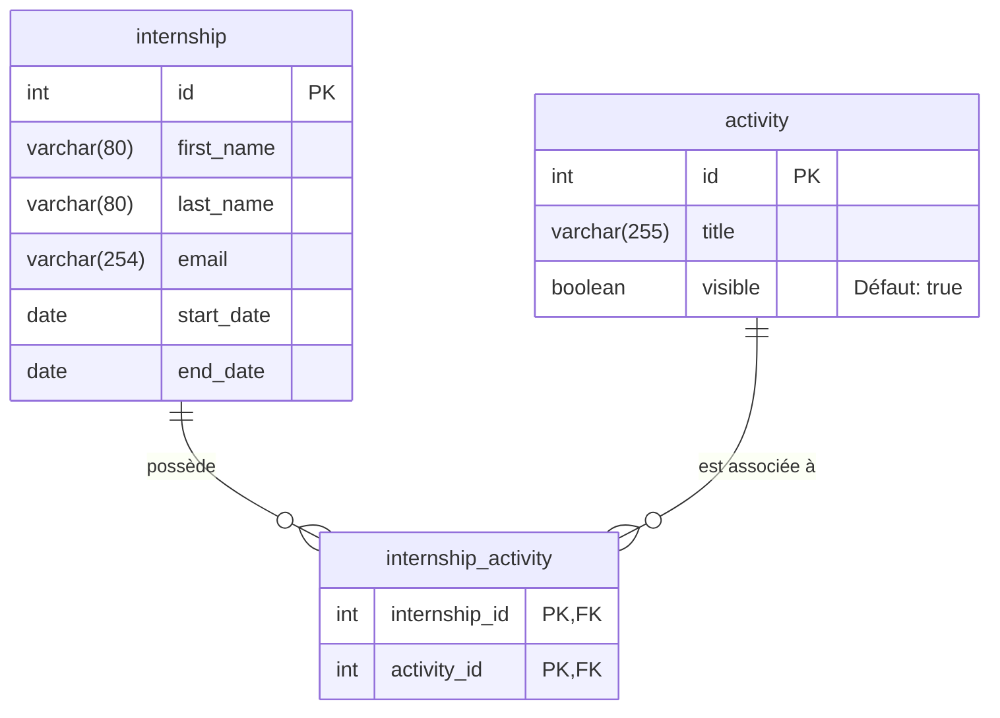
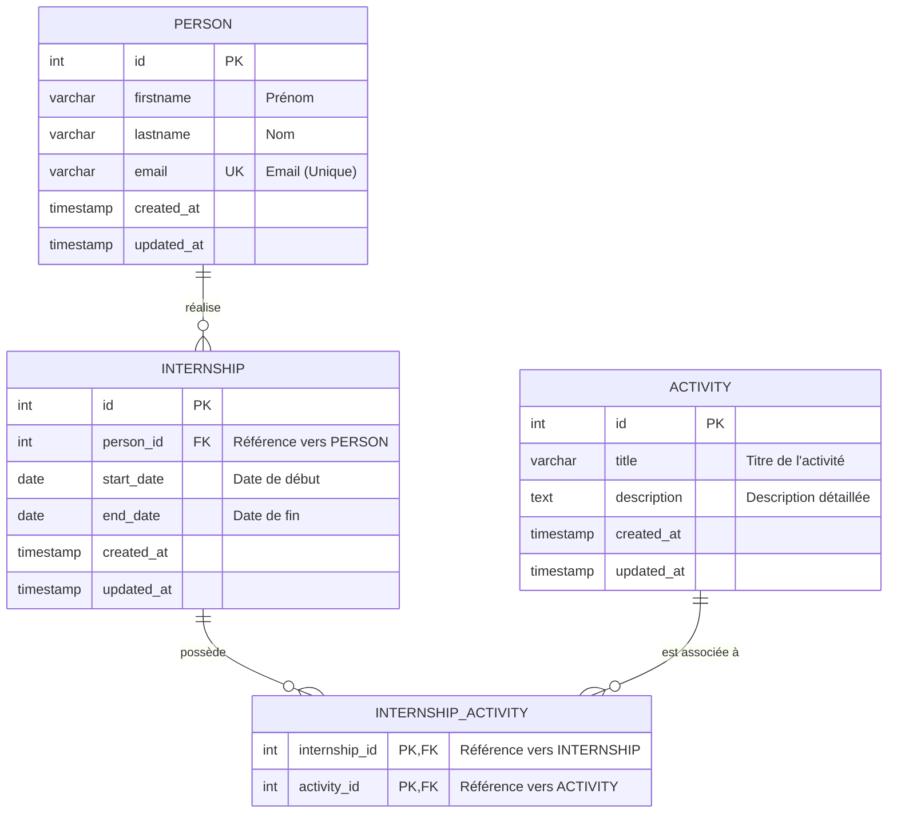

# Schéma de la Base de Données

Ce document présente l'évolution de la structure de la base de données.

## 1. Schéma Actuel (V1)

Ce schéma représente la structure actuelle de la base de données telle qu'elle est en production.
La table `internship` fusionne les informations de la personne et celles du stage.

### Contraintes Techniques (V1)
* **Date de stage** : La date de fin (`end_date`) doit être supérieure ou égale à la date de début (`start_date`), validée par un `CHECK (end_date >= start_date)`.
* **Suppression de Stage** : La suppression d'un `internship` entraîne la suppression automatique (`ON DELETE CASCADE`) de ses entrées de liaison dans `internship_activity`.
* **Suppression d'Activité** : Impossible de supprimer une `activity` tant qu'elle est répertoriée comme étant associée à au moins un stage (`ON DELETE RESTRICT`).

---

## 2. Schéma Cible (V2 - Nouvelles Fonctionnalités)

Ce schéma représente la **nouvelle structure** de la base de données permettant de gérer l'historique des stages pour une même personne, conformément aux nouvelles exigences.

## Description des Relations

1. **`PERSON` 1:N `INTERNSHIP`** : 
   * Une personne (`PERSON`) peut réaliser **plusieurs** stages (`INTERNSHIP`) à des périodes différentes. 
   * Un stage précis appartient à **une seule** personne.
   * La liaison se fait via `person_id` dans la table `INTERNSHIP`.

2. **`INTERNSHIP` N:M `ACTIVITY` (via `INTERNSHIP_ACTIVITY`)** :
   * Un stage peut comporter **plusieurs** activités.
   * Une activité peut être associée à **plusieurs** stages différents.
   * La table de liaison `INTERNSHIP_ACTIVITY` permet de gérer cette relation de plusieurs-à-plusieurs.

### Contraintes Techniques & Suppression (V2)
1. **Unicité (Personne)** : L'adresse `email` de l'entité `PERSON` dispose d'une contrainte d'unicité stricte (`UNIQUE`).
2. **Date de stage** : La date de fin (`end_date`) de chaque `INTERNSHIP` doit impérativement être supérieure ou égale à sa date de début (`start_date`), par une vérification `CHECK (end_date >= start_date)`.
3. **Suppression en Cascade (Personne)** : L'action de supprimer une `PERSON` entraîne instantanément une suppression automatique (`ON DELETE CASCADE`) de la totalité de ses entrées correspondantes dans la table `INTERNSHIP`.
4. **Suppression en Cascade (Stage)** : La suppression d'un `INTERNSHIP` entraîne la suppression en bout de chaîne (`ON DELETE CASCADE`) de ses attributs de liaison dans `INTERNSHIP_ACTIVITY`.
5. **Restriction de Suppression (Activité)** : Interdiction stricte de supprimer une `ACTIVITY` si cette dernière est rattachée à un ou plusieurs stages (`ON DELETE RESTRICT`).
