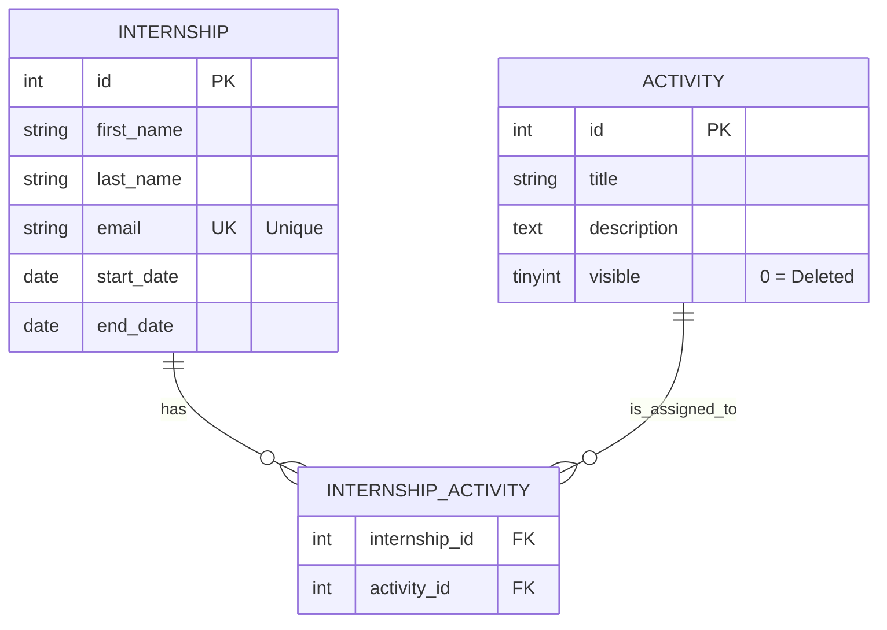

# Documentation des Bases de Données

Ce dossier contient les scripts SQL nécessaires à l'initialisation et à la structure de la base de données MariaDB du projet.

## Fichiers

*   **`schema.sql`** : Script DDL (Data Definition Language) principal.
    *   Crée la base de données `internship_management`.
    *   Crée les tables et définit les relations.
    *   Crée un jeu de données initial (Seed) pour le développement.

## Schéma Relationnel Détaillé

### Diagramme Entité-Relation (ERD)



### 1. Table `internship` (Stagiaires)
Stocke les dossiers administratifs des élèves.

| Colonne | Type | Contraintes | Description |
| :--- | :--- | :--- | :--- |
| `id` | `INT` | `PRIMARY KEY`, `AUTO_INCREMENT` | Identifiant unique. |
| `first_name` | `VARCHAR(50)` | `NOT NULL` | Prénom du stagiaire. |
| `last_name` | `VARCHAR(50)` | `NOT NULL` | Nom de famille. |
| `email` | `VARCHAR(100)` | `UNIQUE`, `NOT NULL` | Email (doit être unique système). |
| `start_date` | `DATE` | `NOT NULL` | Date de début. |
| `end_date` | `DATE` | `NOT NULL` | Date de fin. |

### 2. Table `activity` (Activités)
Liste référentielle des activités possibles (ex: Tennis, Ping-pong).

| Colonne | Type | Contraintes | Description |
| :--- | :--- | :--- | :--- |
| `id` | `INT` | `PRIMARY KEY`, `AUTO_INCREMENT` | Identifiant unique. |
| `title` | `VARCHAR(50)` | `NOT NULL` | Libellé de l'activité. |
| `description` | `TEXT` | `NULLABLE` | Description optionnelle. |
| `visible` | `TINYINT(1)` | `DEFAULT 1` | Gestion de la suppression logique. |

### 3. Table `internship_activity` (Liaison)
Table pivot pour gérer la relation **Many-to-Many** : Un stagiaire peut avoir N activités, et une activité peut concerner N stagiaires.

| Colonne | Type | Relation | Comportement Suppression |
| :--- | :--- | :--- | :--- |
| `internship_id` | `INT` | `FK -> internship(id)` | **ON DELETE CASCADE** (Si le stagiaire est supprimé, ses liaisons le sont aussi). |
| `activity_id` | `INT` | `FK -> activity(id)` | **ON DELETE RESTRICT** (Impossible de supprimer une activité si elle est encore liée à un stagiaire). |

## Usage avec Docker

Le conteneur `mariadb` est configuré pour initialiser la base automatiquement au premier lancement.
Il monte le fichier `database/schema.sql` dans le dossier spécial `/docker-entrypoint-initdb.d/` du conteneur.

**Procédure de Reset Complet** :
Si vous modifiez le schéma SQL, vous devez supprimer le volume Docker existant pour forcer la ré-exécution du script :

```bash
# 1. Arrêter et supprimer les conteneurs et les volumes (-v)
docker-compose down -v

# 2. Relancer
docker-compose up -d
```
