# Spécification du projet

## **Introduction**

Le projet consiste en la création d’une application web autonome destinée à la gestion des stagiaires et au suivi des travaux de stage au sein du centre d'apprentissage.

L’application permet de créer, consulter, modifier et supprimer les informations relatives aux stagiaires. Chaque stagiaire peut effectuer un ou plusieurs stages.

Les activités réalisées peuvent également être créées, modifiées ou supprimées selon les besoins.

Les activités peuvent être associées aux stagiaires pour définir les activités accomplies durant leurs périodes de stage.

## **Public cible**

Cette application est exclusivement destinée à un usage interne :

- Chef du centre d’apprentissage : supervision globale, saisie, mise à jour et suivi quotidien des stagiaires.
- Les apprentis en charge des stages : saisie, mise à jour et suivi quotidien des stagiaires.

Les stagiaires eux-mêmes n’ont pas accès à l’application ; elle sert uniquement de tableau de bord administratif pour l’équipe interne.

## **Objectifs du projet**

Le but de cette application est de :

- Faciliter le suivi administratif et opérationnel des stagiaires.
- Centraliser l’ensemble des informations concernant les périodes de stage, les travaux effectués et les activités accomplies.
- Offrir une interface claire et intuitive permettant aux responsables de stage de gérer efficacement les données.
- Garantir la traçabilité des stages avec une liste contenant les informations des stagiaires et les activités accomplies.

## **Besoins du projet**

Les besoins principaux de l’application sont les suivants :
1. Gestion des stagiaires : création, consultation, modification et suppression des informations relatives aux stagiaires.
   - Nom
   - Prénom
   - Adresse e-mail
   - Date ou période de stage
2. Gestion des activités de stage : création, consultation, modification et suppression des activités réalisables durant les stages.
3. Association des activités aux stagiaires : permettre de lier les activités accomplies aux stagiaires.

## **Fonctionnalités de l’application**

1. Une page affichant la liste des stagiaires.
2. Une page pour gérer les activités de stage (création, modification, suppression).
3. Une page pour gérer les stagiaires (création, modification, suppression).

## **Fonctionnement général de l'application**

Le fonctionnement général de l’application est comme suit :

1. L'utilisateur réalise une action comprise dans les fonctionnalités.
2. Le frontend envoie les requêtes au backend.
3. Une API transmet la requête à la base de données.
4. La base de données effectue les opérations demandées et confirme la réussite à l'API.
5. L'API transmet les nouvelles informations au frontend.

Ce fonctionnement garantit un suivi fluide, cohérent et centralisé des stagiaires et de leurs stages au fil du temps.

## **Ébauche conceptuelle**

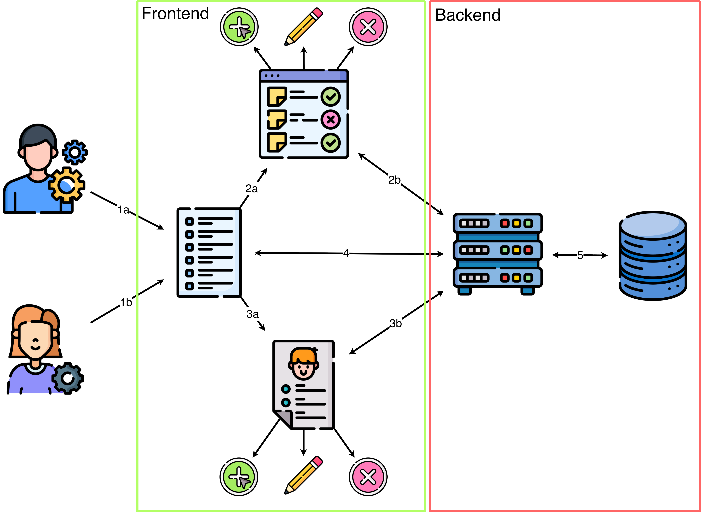

- 1a : Le responsable accède à la liste de stagiaires.
- 1b : L'apprenti accède à la liste des stagiaires. 
- 2a : Les activités de stage peuvent être gérées depuis une page où il est possible de créer, modifier ou supprimer une activité. 
- 2b : L'interface de liste des activités avec une API backend.
- 3a : Les informations détaillées d'un stagiaire ainsi que les activités réalisées peuvent être consultées.
- 3b : L'interface de gestion d'un stagiaire communique avec une API backend.
- 4 : L'interface de liste des stagiaires communique avec une API backend. 
- 5 : L'API backend communique avec la base de données pour stocker et récupérer les informations.

(Des ébauches conceptuelles ont été réalisées pour visualiser l’architecture et les interactions au sein de l’application.)

Chaque concept décrit est considéré comme mise en place et valide pour la suite et n'est pas répété dans la description d'un nouveau concept s'il est nécessaire au préalable.

### **Afficher la liste des stagiaires**

1. L’utilisateur accède à la liste des stagiaires.
2. L'application récupère la liste des stagiaires à la base de données.
3. La liste des stagiaires avec leurs informations (nom, prénom, e-mail, période de stage) est retournée.

### **Consulter les informations détaillées d’un stagiaire**

1. L’utilisateur sélectionne une vignette d'un stagiaire dans la liste.
2. Le système récupère les informations détaillées ainsi que les activités réalisées du stagiaire depuis la base de données.
3. Les informations détaillées du stagiaire sont retournées, y compris la liste des activités associées.

### **Gérer un stagiaire**

**Créer un stagiaire**

1. L’utilisateur crée un nouveau stagiaire.
2. Un formulaire s’affiche pour saisir les informations du stagiaire (nom, prénom, e-mail, période de stage).
3. L’utilisateur remplit le formulaire et le soumet.
4. L'application enregistre le stagiaire dans la base de données.
5. La base de données confirme l'enregistrement.
6. L’utilisateur est redirigé vers la liste des stagiaires.

**Modifier un stagiaire**

1. L'utilisateur modifie les informations d'un stagiaire.
2. Un formulaire s'affiche avec les informations actuelles du stagiaire.
3. L’utilisateur modifie les informations et soumet le formulaire.
4. L'application met à jour les informations du stagiaire dans la base de données.
5. La base de données met les informations détaillées du stagiaire à jour et confirme à l'application.
6. L’utilisateur est redirigé vers les informations détaillées du stagiaire mises à jour.

**Supprimer un stagiaire**

1. L'utilisateur supprime un stagiaire.
2. L'application demande une confirmation de la suppression.
3. L’utilisateur confirme la suppression.
4. Le système supprime le stagiaire de la base de données.
5. La base de données retourne la confirmation de la suppression.
6. L'utilisateur est redirigé vers la liste des stagiaires mises à jour.

### **Consulter la liste des activités**

1. L’utilisateur consulte la liste des activités.
2. L'application récupère la liste des activités à la base de données.
3. La base de données retourne à l’application la liste des activités.

### **Gérer une activité**

**Créer une activité**

1. L’utilisateur crée une activité.
2. Un formulaire apparaît pour saisir les informations de l’activité (titre).
3. L’utilisateur remplit le champ et soumet.
4. L'application enregistre l’activité dans la base de données.
5. La base de données enregistre l'activité et confirme à l'application.
6. L’utilisateur est redirigé vers la liste des activités mise à jour.

**Modifier une activité**

1. L'utilisateur modifie une activité.
2. Un formulaire s'affiche.
3. L’utilisateur modifie les informations et soumet.
4. L'application envoie les modifications dans la base de données.
5. La base de données enregistre les informations et retourne une confirmation à l'application.
6. L’utilisateur est redirigé vers la liste des activités mise à jour.

**Supprimer une activité**

1. L'utilisateur supprime une activité.
2. L'application demande une confirmation de la suppression.
3. L’utilisateur confirme la suppression.
4. L'application envoie la suppression de l’activité de la base de données.
5. La base de données supprime l'activité et retourne la confirmation à l'application.
6. L’utilisateur est redirigé vers la liste des activités mise à jour.

### **Gérer les activités d'un stagiaire**

1. L'utilisateur modifie les activités réalisées par un stagiaire.
2. La liste des activités disponibles apparaît pour saisir l’activité.
3. L’utilisateur sélectionne une activité et soumet.
4. L'application envoie l’activité à la base de données.
5. La base de données enregistre les modifications et confirme à l'application.
6. L’utilisateur est redirigé vers les informations détaillées du stagiaire mises à jour.

## **Use case diagramme**

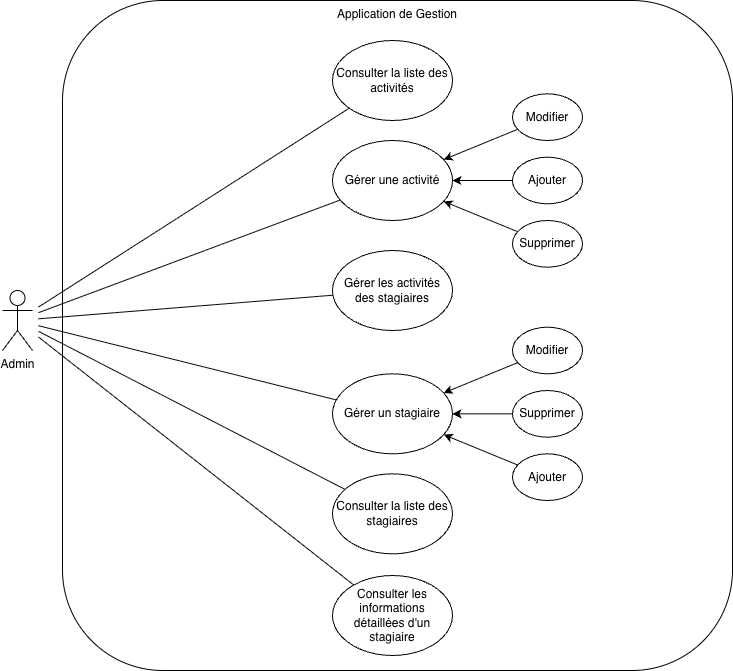

Ce diagramme illustre les interactions entre les utilisateurs (Chef du centre d'apprentissage et apprentis) et le système. Les fonctionnalités principales incluent la gestion complète des dossiers des stagiaires (création, modification, suppression, consultation) ainsi que la gestion du catalogue d'activités et leur affectation aux périodes de stage.

## **Diagrammes de séquence**

### **Afficher la liste des stagiaires**

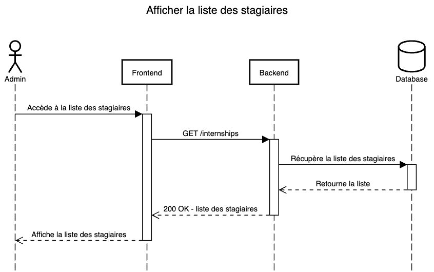

L'utilisateur accède à l'application web. Le système envoie une requête ``GET /internships`` au backend pour récupérer la liste des stagiaires. Le backend interroge la base de données et renvoie la liste des stagiaires au système, qui l'affiche à l'utilisateur.

**Évènements pouvant perturber le cycle :**
- Backend indisponible
- Base de données indisponible
- Aucun stagiaire enregistré
- Erreur lors de la récupération des données

### **Consulter les informations détaillées d’un stagiaire**

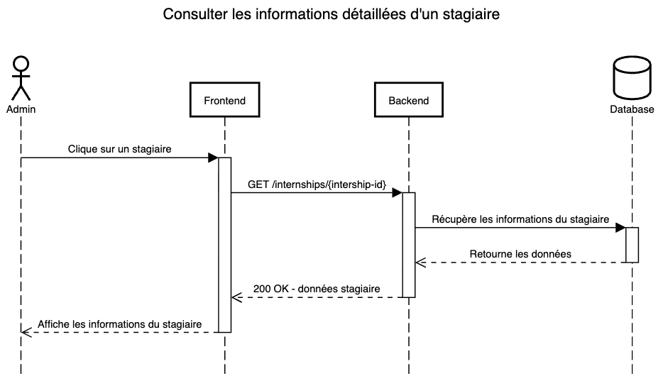

L'utilisateur sélectionne un stagiaire dans la liste. Le système envoie une requête ``GET /internships/{internship-id}`` au backend pour récupérer les informations détaillées du stagiaire. Le backend interroge la base de données et renvoie les informations détaillées au système, qui les affiche à l'utilisateur.

**Évènements pouvant perturber le cycle :**
- Backend indisponible
- Base de données indisponible
- Stagiaire non trouvé
- Erreur lors de la récupération des données

### **Créer un stagiaire**

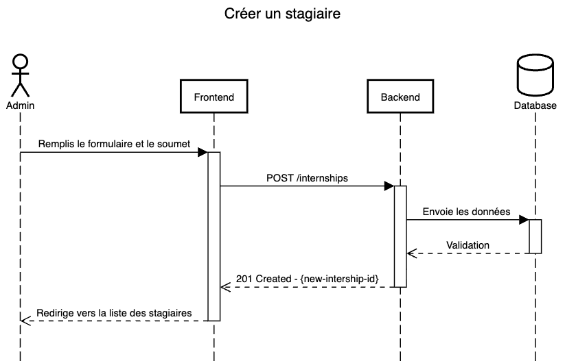

L'utilisateur remplit le formulaire de création d'un stagiaire et le soumet. Le système envoie une requête ``POST /internships`` au backend avec les données du stagiaire. Le backend enregistre le stagiaire dans la base de données et renvoie une confirmation au système, qui met à jour la liste des stagiaires affichée à l'utilisateur.

**Évènements pouvant perturber le cycle :**
- Backend indisponible
- Base de données indisponible
- Données invalides
- Erreur lors de l'enregistrement des données

### **Modifier un stagiaire**

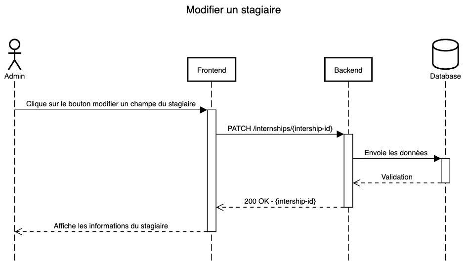

L'utilisateur modifie les informations d'un stagiaire et soumet le formulaire. Le système envoie une requête ``PATCH /internships/{internship-id}`` au backend avec les nouvelles données du stagiaire. Le backend met à jour les informations dans la base de données et renvoie une confirmation au système, qui met à jour les informations affichées à l'utilisateur.

**Évènements pouvant perturber le cycle :**
- Backend indisponible
- Base de données indisponible
- Stagiaire non trouvé
- Données invalides
- Erreur lors de la mise à jour des données

### **Supprimer un stagiaire**

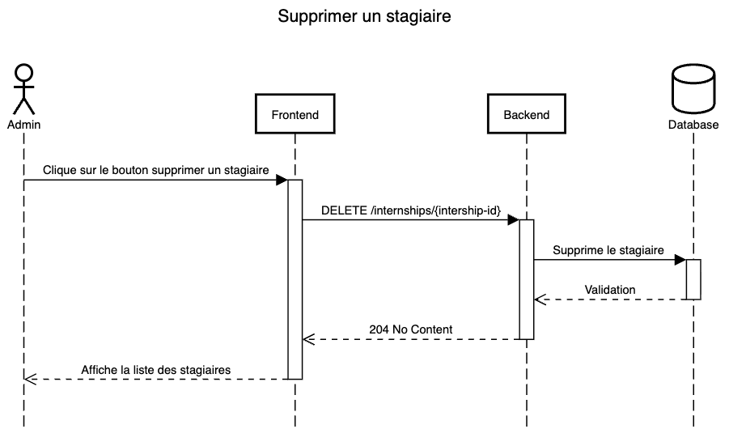

L'utilisateur supprime un stagiaire. Le système envoie une requête ``DELETE /internships/{internship-id}`` au backend. Le backend supprime le stagiaire de la base de données et renvoie une confirmation au système, qui met à jour la liste des stagiaires affichée à l'utilisateur.

**Évènements pouvant perturber le cycle :**
- Backend indisponible
- Base de données indisponible
- Stagiaire non trouvé
- Erreur lors de la suppression des données

### **Consulter la liste des activités**

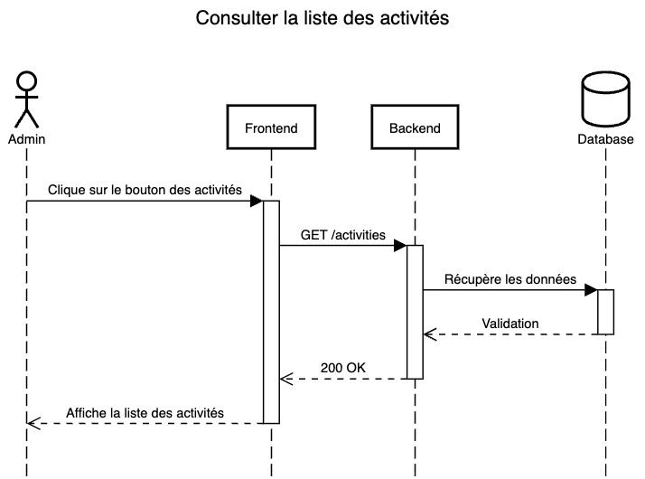

L'utilisateur accède à la section des activités. Le système envoie une requête ``GET /activities`` au backend pour récupérer la liste des activités. Le backend interroge la base de données et renvoie la liste des activités au système, qui l'affiche à l'utilisateur.

**Évènements pouvant perturber le cycle :**
- Backend indisponible
- Base de données indisponible
- Aucune activité enregistrée
- Erreur lors de la récupération des données

### **Créer une activité**

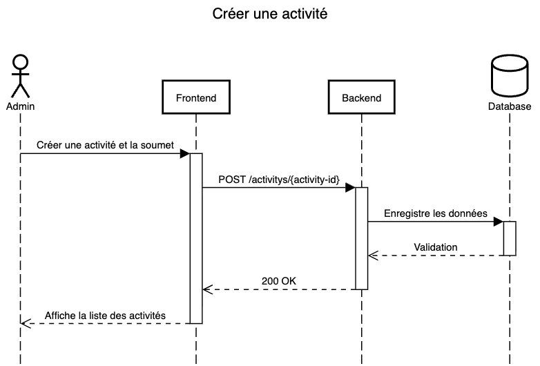

L'utilisateur remplit le formulaire de création d'une activité et le soumet. Le système envoie une requête ``POST /activities`` au backend avec les données de l'activité. Le backend enregistre l'activité dans la base de données et renvoie une confirmation au système, qui met à jour la liste des activités affichée à l'utilisateur.

**Évènements pouvant perturber le cycle :**
- Backend indisponible
- Base de données indisponible
- Données invalides
- Erreur lors de l'enregistrement des données

### **Modifier une activité**

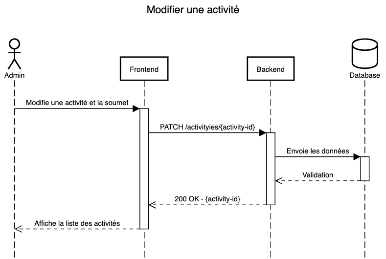

L'utilisateur modifie les informations d'une activité et soumet le formulaire. Le système envoie une requête ``PATCH /activities/{activity-id}`` au backend avec les nouvelles données de l'activité. Le backend met à jour les informations dans la base de données et renvoie une confirmation au système, qui met à jour les informations affichées à l'utilisateur.

**Évènements pouvant perturber le cycle :**
- Backend indisponible
- Base de données indisponible
- Activité non trouvée
- Données invalides
- Erreur lors de la mise à jour des données

### **Supprimer une activité**

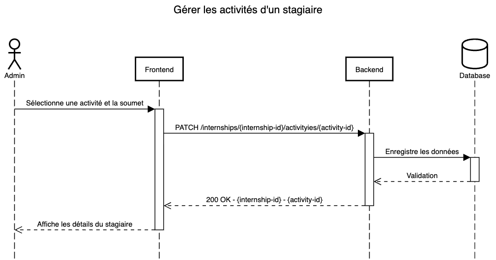

L'utilisateur confirme la suppression d'une activité. Le système envoie une requête ``DELETE /activities/{activity-id}`` au backend. Le backend supprime l'activité de la base de données et renvoie une confirmation au système, qui met à jour la liste des activités affichée à l'utilisateur.

**Évènements pouvant perturber le cycle :**
- Backend indisponible
- Base de données indisponible
- Activité non trouvée
- Erreur lors de la suppression des données

### **Gérer les activités d'un stagiaire**

L'utilisateur ajoute une activité à un stagiaire en soumettant le formulaire. Le système envoie une requête ``POST /internships/{internship-id}/activities/{activity-id}`` au backend avec l'identifiant de l'activité. Le backend associe l'activité au stagiaire dans la base de données et renvoie une confirmation au système, qui met à jour les informations détaillées du stagiaire affichées à l'utilisateur.

## **Base de données**

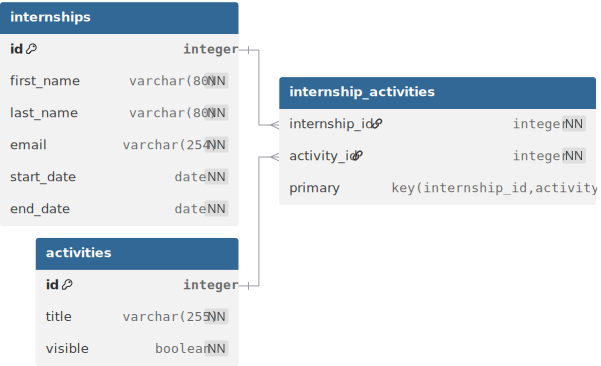

Le modèle de données est composé de trois tables principales :

### 1. **Table `internships`**
Cette table stocke les informations relatives aux stagiaires.

| Champ        | Type         | Contraintes                 | Description                     |
| :----------- | :----------- | :-------------------------- | :------------------------------ |
| `id`         | integer      | PRIMARY KEY, AUTO_INCREMENT | Identifiant unique du stagiaire |
| `first_name` | varchar(80)  | NOT NULL                    | Prénom du stagiaire             |
| `last_name`  | varchar(80)  | NOT NULL                    | Nom de famille du stagiaire     |
| `email`      | varchar(254) | NOT NULL                    | Adresse e-mail du stagiaire     |
| `start_date` | date         | NOT NULL                    | Date de début du stage          |
| `end_date`   | date         | NOT NULL                    | Date de fin du stage            |

**Contraintes supplémentaires :**
- `chk_internship_dates_valid` : La date de fin doit être supérieure ou égale à la date de début (`end_date >= start_date`).

### 2. **Table `activities`**
Cette table répertorie les activités disponibles pour les stages.

| Champ     | Type         | Contraintes            | Description                      |
| :-------- | :----------- | :--------------------- | :------------------------------- |
| `id`      | integer      | PRIMARY KEY, AUTO_INCREMENT | Identifiant unique de l'activité |
| `title`   | varchar(255) | NOT NULL               | Titre de l'activité              |
| `visible` | boolean      | NOT NULL, DEFAULT true | Visibilité dans le frontend      |

### 3. **Table `internship_activities`**
Table de liaison permettant d'associer des activités aux stagiaires (relation Many-to-Many).

| Champ           | Type    | Contraintes                 | Description            |
| :-------------- | :------ | :-------------------------- | :--------------------- |
| `internship_id` | integer | FOREIGN KEY (internships.id)| Référence au stagiaire |
| `activity_id`   | integer | FOREIGN KEY (activities.id) | Référence à l'activité |

**Clé primaire composée :** (`internship_id`, `activity_id`)

**Clés étrangères :**
- `internship_id` -> `internships(id)` : Suppression en cascade (`ON DELETE CASCADE`).
- `activity_id` -> `activities(id)` : Restriction de suppression (`ON DELETE RESTRICT`).

### **Relations entre les tables**

*   **Relation Many-to-Many (N:M) entre `internships` et `activities`** :
    *   Un stagiaire peut avoir plusieurs activités.
    *   Une activité peut être assignée à plusieurs stagiaires.
    *   Cette relation est gérée par la table de liaison `internship_activities`.

*   **Intégrité référentielle** :
    *   **Suppression d'un stagiaire** : Si un stagiaire est supprimé (`DELETE FROM internships`), toutes ses associations avec des activités sont automatiquement supprimées dans `internship_activities` (Cascade).
    *   **Suppression d'une activité** : Une activité ne peut pas être supprimée si elle est assignée à au moins un stagiaire (Restrict). Cela garantit qu'on ne perd pas l'historique des activités réalisées.
